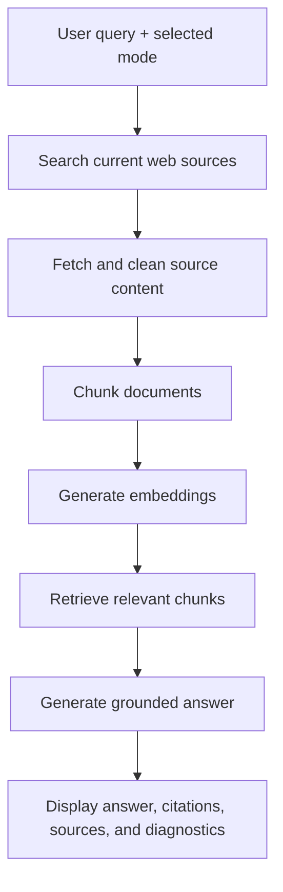

# AI Roadmap & Project Research Copilot

Live app: [researchagent12.streamlit.app](https://researchagent12.streamlit.app/)

AI Roadmap & Project Research Copilot is a research assistant for students and developers who are trying to learn AI/ML without getting lost in random tutorials. It searches the web, retrieves useful sources, builds a small semantic index, and generates grounded answers with citations.

The goal is simple: ask a learning or project question and get an answer that feels structured, current, and source-backed.

## What It Can Do

- Validate AI/ML/software roadmaps and point out missing topics.
- Suggest practical project ideas based on a topic or skill area.
- Generate short learning plans for AI/ML topics.
- Search current web sources and show source cards.
- Retrieve relevant chunks using embeddings.
- Generate citation-backed answers.
- Show retrieval diagnostics like source diversity, citation coverage, evidence accuracy, and source mix.
- Export generated reports as Markdown.

## Why I Built This

Many beginners know they want to learn AI, ML, or software engineering, but they do not know which roadmap is reliable. Search results are scattered, tutorials go out of date, and normal chatbot answers often do not show where the information came from.

This project combines web search, embeddings, retrieval, and an LLM response layer to make the answer more grounded and easier to trust.

## Tech Stack

| Layer | Technology |
| --- | --- |
| UI | Streamlit |
| Language | Python |
| Web Search | Exa API |
| LLM + Embeddings | Google Gemini |
| RAG Flow | LangChain-style modular pipeline |
| Retrieval | In-memory semantic vector retrieval |
| Testing | Pytest |
| Deployment | Streamlit Community Cloud |

## App Modes

### General Research

Ask a technical question and get a source-backed explanation.

Example:

```text
What is retrieval-augmented generation and when should I use it?
```

### Roadmap Validator

Paste a roadmap and the app reviews its order, gaps, and practicality.

Example:

```text
Python basics -> ML -> Deep Learning -> LLMs. Is this roadmap complete?
```

### Project Idea Generator

Ask for projects around a skill or tool and get structured ideas.

Example:

```text
Suggest AI projects using RAG, LangChain, and a vector database.
```

### Learning Plan Generator

Ask for a focused plan over a few days or weeks.

Example:

```text
Make a 7-day plan to learn RAG as a beginner.
```

## How It Works



## Local Setup

```powershell
python -m venv .venv
.\.venv\Scripts\Activate.ps1
pip install -r requirements.txt
Copy-Item .env.example .env
```

Add your API keys locally:

```text
EXA_API_KEY=your_exa_key
GOOGLE_API_KEY=your_google_key
```

Run the app:

```powershell
streamlit run app.py
```

## Deployment Notes

The app is deployed on Streamlit Community Cloud:

[https://researchagent12.streamlit.app/](https://researchagent12.streamlit.app/)

For deployment, add these as Streamlit secrets:

```toml
EXA_API_KEY = "your_key"
GOOGLE_API_KEY = "your_key"
```

Do not commit real API keys to GitHub.

## Testing

```powershell
pytest -q
```

Current coverage focuses on:

- Config loading
- Search result normalization
- Text cleaning and chunking
- Prompt selection
- Response cleanup
- Citation formatting
- Retrieval diagnostics
- In-memory semantic retrieval

## Project Highlights

- Built an end-to-end RAG-style research assistant with web search, semantic retrieval, citations, and evaluation diagnostics.
- Designed a Streamlit UI with multiple AI workflow modes.
- Added tests for the main pipeline utilities and deployment-safe retrieval logic.
- Deployed the project publicly on Streamlit Cloud.

## Future Improvements

- Add user accounts and saved research collections.
- Support uploaded PDFs and notes.
- Add GitHub repository analysis for project reviews.
- Add richer evaluation metrics with labeled test queries.
- Add Notion or Markdown workspace export.
